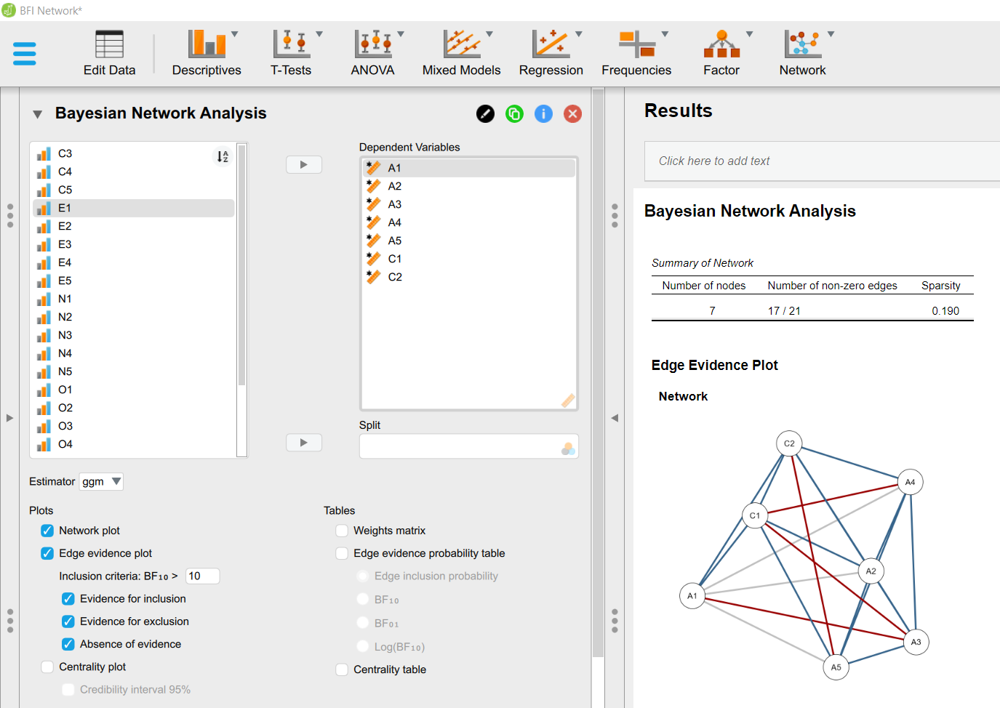

# Bayesian Graphical Modeling

## Bayesian Graphical Modeling in a Nutshell

The distinctive advantage of the Bayesian way of thinking is by systematically updating our prior knowledge and uncertainty with new information coming from the data. In network psychometrics, the Bayesian approach allows us to quantify uncertainty about which edges are present or absent and calculate probabilities for the inclusion of each edge given the data (i.e., making inferences about the network structure). This enables us to test hypotheses about edge presence *and* absence, by quantifying the evidence in the data for both cases—something not possible within the frequentist framework. For an accessible introduction to the Bayesian framework, specifically for psychology and behavioral sciences, we refer readers to @WagenmakersEtAL_2018_BIP1 or @vandeSchootEtAl_2014_GentleIntro. For a gentle introduction to Bayesian graphical modeling, see @HuthEtAl_2023; and for a more detailed discussion on testing conditional (in)dependence in Bayesian graphical models, see @Sekulovski_2.

## Software Overview

Three R packages facilitate the Bayesian analysis of graphical models: **bgms** [@bgms] for binary and ordinal data, as well as **BDgraph** [@bdgraph], and **BGGM** [@BGGM],  which handle Gaussian graphical models and Gaussian copula models [the latter allow for the analysis of non-continuous data @DobraLenkoski_2011]. In this workshop, we will focus on the **easybgm** package, which integrates **bgms**, **BDgraph**, and **BGGM** in a user-friendly manner. This chapter introduces the core functionalities of **easybgm** through a simple example. For more comprehensive information, refer to the software paper [@easybgm].

The R package **BDgraph** is also implemented in the open-source software JASP [@JASP], which is a user-friendly alternative for those who prefer a point and click graphical user interface. Soon, all the functionalities of the **easybgm** package will also be available in JASP. 

## Taking easybgm for a Spin 

Before illustrating how to perform an analysis using the **easybgm** package, a word of caution: to avoid possible installation problems, please make sure you have the latest version of R installed. As of January 2025, the latest version of R is [4.4.2](https://cran.rstudio.com/).

With that out of the way, we will now briefly discuss some of the main features of the package before illustrating them with an example analysis.

Let's install and load the package:
```{r message=FALSE, warning=FALSE}
# install.packages("easybgm")
library(easybgm)
```

The first thing we want to do is familiarize ourselves with the basic functionalities of the package. For this, we strongly recommend reading @easybgm.

The main function used to analyze the data is also conveniently called `easybgm`:
```{r eval=FALSE}
?easybgm
```

As shown in the function's help file, the two mandatory arguments required by the function are: (1) the data in a (number of observations) $n \times p$ (number of variables) format, as a data frame or matrix structure, and (2) the level of measurement of the variables in the data set, which can be set to `continuous`, `mixed`, `ordinal`, or `binary`. Based on the latter argument, the package automatically selects one of the three underlying packages for analysis. Specifically, if the `type` argument is set to `continuous` or `mixed`, the `BGGM` package is used by default; If set to `ordinal` or `binary`, the `bgms` package is used. However, these default options can be overwritten using the optional `package` argument. In the case where the `type` argument is set to `mixed`, the `not_cont` argument must also be passed, which takes a vector of length $p$ of numbers indicating which variables in the data set are not continuous (1 for not continuous, 0 for continuous). 

The `save` argument can be set to `TRUE` if users wish to save samples from each iteration of the analysis, which is necessary to obtain credible intervals for the edge weight parameters (by default, this argument is set to `FALSE`). Additionally, the `centrality` argument calculates the strength centrality measure for each node. Finally, the `iter` argument sets the number of iterations for the analysis (defaults to 10,000). For the final analysis, we strongly recommend running the analysis with at least 100,000 iterations [cf., @easybgm]. We highly encourage users to read the package documentation carefully, especially the details on specifying prior distributions for the three underlying packages.

Other important functions include:

- `plot_edgeevidence`: Plots the network with edges color-coded according to the results of the inclusion Bayes factor - blue for evidence of inclusion, red for evidence of exclusion, and gray for inconclusive evidence. The `evidence_thresh` argument specifies the cutoff value for the inclusion Bayes factor, and the `split` argument divides the edge evidence plot at $\text{BF}_{10} = 1$.

- `plot_network`: Plots the network with the estimated parameters. By default, it includes all edges for which the posterior inclusion probability exceeds 0.5 (or which have a inclusion Bayes factor larger than 1). Users can change this default value with the  the `exc_prob` argument. 

- `plot_parameterHDI`: Displays posterior estimates of edge weights with their 95% highest density intervals (HDIs).

- `plot_centrality`: Plots strength centrality measures with a 95% credible interval.

- `plot_structure_probabilities`: Visualizes the posterior distribution of structure probabilities for all simulated structures. When the `as_BF` argument is set to `TRUE`, the plot shows the Bayes factor of the most likely structure against all other structures.

- `plot_complexity_probabilities`: Shows posterior probabilities of structures with different numbers of included edges (complexity simply denotes the number of present edges in a network, which can range from 0 to $p\times(p-1)/2$.

- `plot_structure`: Plots the structure with edges having a Bayes factor larger than 1.

### Running an Analysis

To demonstrate how to use **easybgm** We will use the first 5 variables fron the`Wenchuan` data set, which contains 362 observations on 17 ordinal items measuring symptoms of posttraumatic stress disorder [@McNallyEtAl_2015]. The data is openly available in the package **bgms**. 
```{r, cache=TRUE, warning=FALSE}
library(bgms)
fit <- easybgm(Wenchuan[, 1:5], 
                type = "ordinal", 
                save = TRUE, 
                centrality = TRUE)
```

The first step after estimating the model is to explore the results using the `summary` function. This provides a clear overview, including details about the package used, the number of variables, and the data type. A table of edge-specific information is the second part of the summary and includes:

- The posterior parameter estimate,
- The posterior inclusion probability,
- The inclusion Bayes factor, and
- The classification of the edge as included, excluded, or inconclusive, depending on the cutoff for the Bayes factor.

This function also displays an edge overview, showing how many edges were found to have evidence for inclusion, exclusion, or insufficient evidence. Finally, if the **bgms** or **BDgraph** packages were used to perform the analysis, an additional structure overview is shown (only available if `save = TRUE` in the `easybgm` function), showing the number of  visited structures, the number of possible structures (which is simply $2^{p\times(p-1)/2}$), and the posterior probability of the most likely structure.
```{r}
summary(fit)
```

We can use the `fit` object as an argument in all the other functions.

The edge evidence plot:
```{r}
plot_edgeevidence(fit)
```

The plot for the estimated edge weights:
```{r}
plot_network(fit)
```

The HDI plot for all edge weights (Note we set the argument `save = TRUE`):
```{r, cache=TRUE, warning=FALSE}
plot_parameterHDI(fit)
```


The centrality plot:
```{r}
plot_centrality(fit)
```

The three different structure plots:
```{r}
plot_structure_probabilities(fit)
plot_complexity_probabilities(fit)
plot_structure(fit)
```

## JASP 

As already mentioned in the introduction, the **BDgraph** package is also implemented in the open-source point-and-click software JASP. JASP can be easily installed from the [JASP website](https://jasp-stats.org/).

This software provides a user-friendly interface for Bayesian graphical modeling, which is especially useful for those who prefer a graphical user interface. The functionalities of the **easybgm** package will soon be available in JASP as well in the coming months. Below is a screenshot of the JASP interface for Bayesian graphical modeling.





